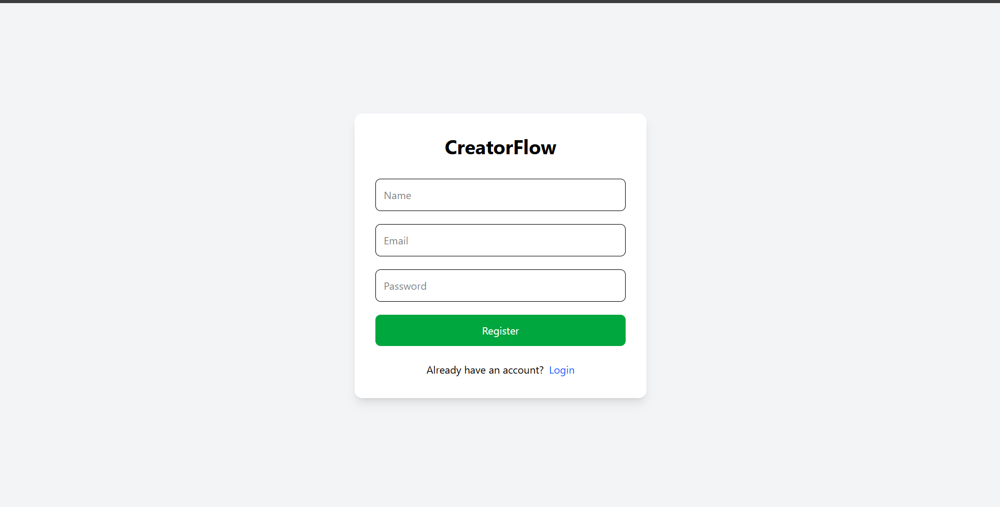
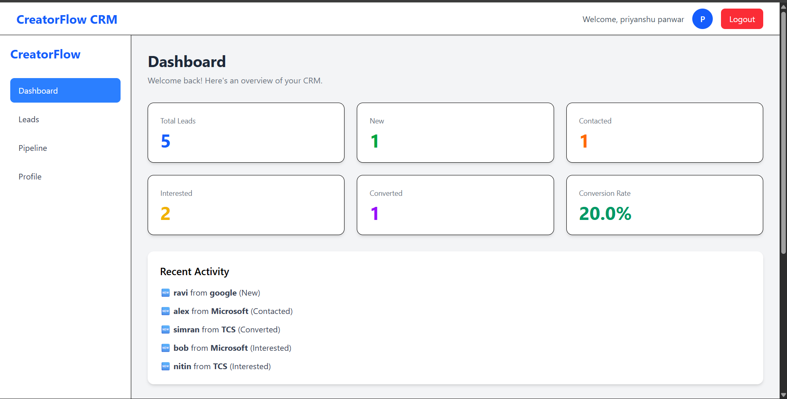
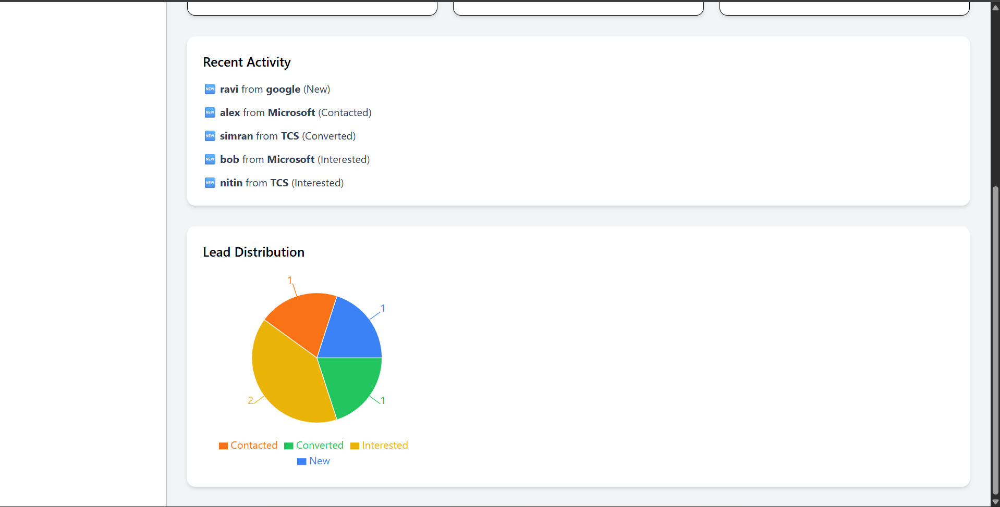
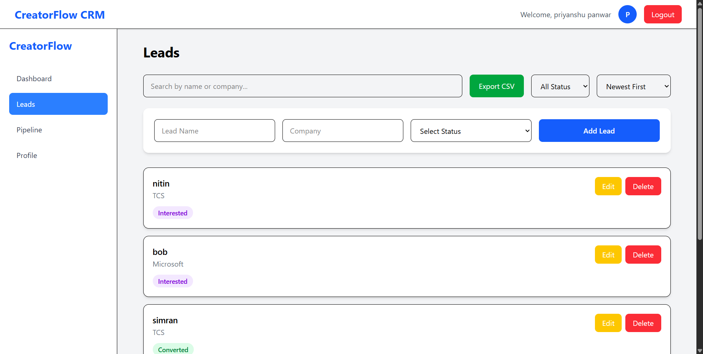
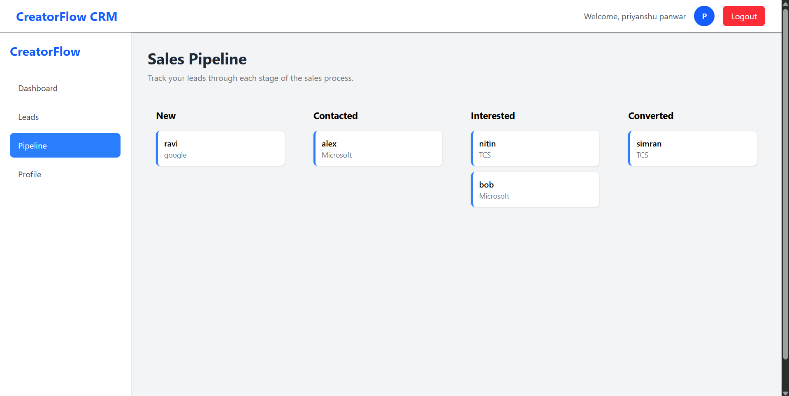
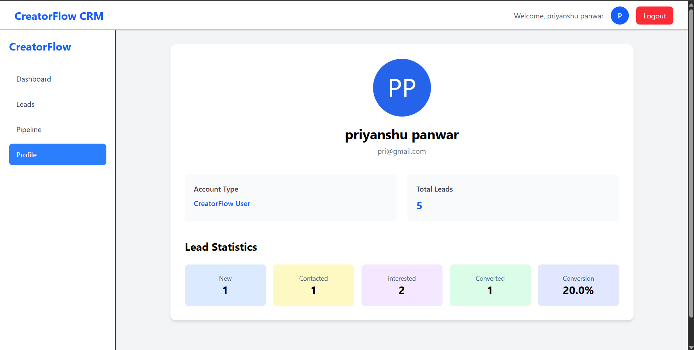

# 🚀 CreatorFlow CRM

A modern full-stack CRM (Customer Relationship Management) application built using the MERN Stack. CreatorFlow CRM helps users manage leads efficiently through authentication, lead tracking, analytics, and a visual sales pipeline.

---
# 📸 Screenshots

## Login



---

## Dashboard



---

## Leads



---

## Pipeline



---

## Profile


---

## ✨ Features

### 🔐 Authentication
- User Registration
- Secure Login
- JWT Authentication
- Protected Routes
- Logout Functionality

---

### 📋 Lead Management

- Create Lead
- Update Lead
- Delete Lead
- Search Leads
- Filter Leads by Status
- Export Leads to CSV
- Duplicate Lead Prevention

---

### 📊 Dashboard

- Total Leads
- New Leads
- Contacted Leads
- Interested Leads
- Converted Leads
- Conversion Rate
- Lead Distribution Chart
- Recent Activity

---

### 📌 Sales Pipeline

Visual lead organization based on status:

- 🆕 New
- 📞 Contacted
- 💡 Interested
- ✅ Converted

---

### 👤 User Profile

- Dynamic User Information
- Lead Statistics
- Conversion Percentage
- Account Summary

---

## 🛠 Tech Stack

### Frontend

- React.js
- React Router DOM
- Context API
- Axios
- Tailwind CSS
- Recharts
- React Hot Toast

### Backend

- Node.js
- Express.js
- MongoDB
- Mongoose
- JWT Authentication
- bcryptjs

---

## 📁 Folder Structure

```
CreatorFlow CRM
│
├── client
│   ├── src
│   │   ├── components
│   │   ├── context
│   │   ├── layouts
│   │   ├── pages
│   │   ├── routes
│   │   ├── services
│   │   └── utils
│
├── server
│   ├── controllers
│   ├── middleware
│   ├── models
│   ├── routes
│   ├── config
│   └── server.js
│
└── README.md
```

---

## ⚙️ Installation

### Clone Repository

```bash
git clone [https://github.com/yourusername/creatorflow-crm.git](https://github.com/priyanshupnwr/creatorflow-crm.git)
```

### Go inside project

```bash
cd creatorflow-crm
```

---

### Backend Setup

```bash
cd server
npm install
```

Create a `.env` file

```env
PORT=5000

MONGO_URI=your_mongodb_connection

JWT_SECRET=your_secret_key
```

Run backend

```bash
npm run dev
```

---

### Frontend Setup

```bash
cd client
npm install
npm run dev
```

---

## 🌐 API Endpoints

### Authentication

| Method | Endpoint |
|---------|----------|
| POST | /api/auth/register |
| POST | /api/auth/login |

---

### Leads

| Method | Endpoint |
|---------|----------|
| GET | /api/leads |
| POST | /api/leads |
| PUT | /api/leads/:id |
| DELETE | /api/leads/:id |

---

## 📈 Future Improvements

- Drag & Drop Pipeline
- CSV Import
- Team Collaboration
- Email Notifications
- Dark Mode
- Lead Notes
- Lead Tags
- Advanced Analytics

---

## 🎯 Learning Outcomes

While building this project, I gained practical experience with:

- MERN Stack Development
- JWT Authentication
- REST API Design
- CRUD Operations
- Context API State Management
- MongoDB & Mongoose
- Protected Routes
- Data Visualization
- Component-based Architecture

---

## 👨‍💻 Author

**Priyanshu Panwar**

GitHub: [click me !](https://github.com/priyanshupnwr)

LinkedIn: [click me !](https://www.linkedin.com/in/priyanshu-panwar-9731b9288/)

---

## ⭐ If you like this project

Give it a ⭐ on GitHub!